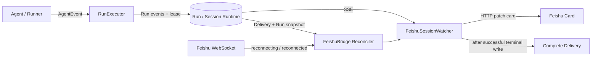

# 飞书运行状态对账与重连恢复设计

- Status: Accepted for implementation
- Date: 2026-08-21
- Scope: 飞书运行卡片的事实源对账、断流展示、WebSocket 重连、Bridge 重启恢复和 Delivery 终态闭环
- Amends: `docs/superpowers/specs/2026-08-21-feishu-persistent-run-status-design.md`
- Out of scope: 修改 Runtime Run 状态机、缩短现有 Lease 参数、为 Telegram 增加同款运行状态栏、重做卡片正文投影、为永久失效卡片建设 exactly-once 降级消息 outbox

## 1. 决策摘要

飞书卡片不再根据本地定时器和“多久没收到 AgentEvent”推断任务是否仍在运行。修复后：

1. Runtime Run 是任务状态的唯一事实源；
2. Runtime Run、Core SSE、飞书入站 WebSocket 和飞书 HTTP 写卡是四个独立维度；
3. 每 15 秒的显示刷新只负责更新时间文案，另设真实的 Delivery/Run 对账；
4. WebSocket 重连成功后立即对账，不等待下一个周期；
5. Bridge 重启恢复时从持久化 Run 快照恢复，禁止把已有终态的 Run 重新初始化为 `running`；
6. 卡片终态更新成功后才完成 Delivery；失败保持可恢复并重试；
7. “任务连接保持”文案下线，因为它同时混淆了任务状态、事件流状态和飞书连接状态。

本方案选择“基于现有 Delivery API 扩充只读 Run 快照并周期对账”。它能修复本次缺陷，同时保持共享业务状态转换仍由 Bridge/后端维护。

## 2. 生产问题与证据

同一个飞书会话同时出现：

- 运行卡片显示“任务连接保持 · 已运行 11 分钟”；
- `/status` 显示 `activeRun: (none)`、`runnerActive: 否`；
- Run 表显示 `succeeded`；
- Session Runtime 显示 `active_run_id = null`、队列 `ready`；
- Delivery 已有 `run_terminal_at`，但状态仍为 `delivering`；
- runner-host 没有活跃 Agent 子进程。

这证明 Agent/Runtime 已进入终态，飞书表面没有闭环。当前卡片展示的是 adapter 内存中的过期状态，不是 Runtime 事实。

## 3. 根因

### 3.1 恢复路径无条件创建运行态

`resumeCardForRun` 调用 `createFeishuRunStatus()`，无论 Delivery 是否已有 `run_terminal_at`、Run 是否已终态，都会重新创建 `running` 状态并启动计时器。

### 3.2 定时器只重绘，不检查

现有 15 秒 `statusTimer` 只执行 `queueRender(true)` 或 `updateCard(...)`。它不查询 Run、Session Runtime、Lease、Delivery 或事件流连接状态，因此不能发现任务已经结束或连接已经断开。

### 3.3 quiet 文案错误声称连接仍在

超过 quiet 阈值后，renderer 仅把标题切换为“任务连接保持”。判断条件只有 `now - lastActivityAt`，没有任何连接或 Runtime 核验。

### 3.4 WebSocket 重连没有业务回调

SDK 已启用 `autoReconnect`，当前 `reconnected` 回调只记录“飞书 WebSocket 已重连”，不会重新读取 Delivery、核验 Run 或补写卡片。

### 3.5 四个维度被压成一个布尔量

当前展示层把以下四个问题混为“是否 running”：

- Runtime Run 是否仍在执行；
- Bridge 是否仍能消费 Core API 事件流；
- 飞书 WebSocket 是否仍能接收入站消息；
- 飞书 HTTP 是否仍能更新原卡片。

其中任一连接断开，都不能直接证明 Runtime Run 已终止；反过来，连接存在也不能证明 Run 仍在执行。

## 4. 目标与非目标

### 4.1 目标

- 卡片 Run 状态始终与 Runtime 最终一致；
- 飞书断流、Core API 事件流断开和 Runtime 终态使用不同文案；
- WebSocket 重连后立即补做一次真实对账；
- Bridge 重启后能恢复原卡片并收敛终态；
- 卡片更新失败不会提前完成 Delivery；
- Runtime 已有终态时，一个对账周期内停止虚假计时；
- Runner 真正失联时，复用现有 Lease 恢复机制收敛为 `interrupted`；
- 正常运行、失败、停止、中断和无输出路径不回归。

### 4.2 非目标

- 飞书 adapter 不自行写入 `RUN_INTERRUPTED`；
- 不用“超过 N 分钟无 AgentEvent”判定任务死亡；
- 不修改 15 秒心跳、60 秒 Lease、15 秒恢复扫描参数；
- 不为 Telegram 新增运行状态栏；
- 不把状态对账逻辑放进 `ChannelStreamProjector`；
- 不新增数据库列，优先使用现有 Run 与 Delivery 字段组成只读快照。

## 5. 方案比较

### 5.1 方案 A：只改 quiet 文案和恢复初值

做法：把“任务连接保持”改成“暂无新事件”，发现 `run_terminal_at` 时直接显示“已中断”。

优点是改动小。缺点是无法区分成功、失败、停止和中断，也没有真正的周期核验；本次现象可能换一种文案继续存在。因此拒绝。

### 5.2 方案 B：Delivery 携带 Run 快照，Bridge 周期对账

做法：`listDeliveries` 联表返回 Run 快照；Bridge 连接后、每 15 秒以及飞书 WebSocket `reconnected` 后统一执行幂等对账；SessionWatcher 只把权威快照投影到卡片。

优点：

- 不复制 Runtime 状态机；
- 不增加新的远程依赖；
- 复用现有 Delivery API 和恢复入口；
- 同时覆盖正常运行、断流、重连和进程重启；
- 可用合同测试与飞书表面测试验证。

缺点是 `FeishuSessionWatcher` 和状态 renderer 位于多条飞书主链路上，需要严格回归。选择该方案。

### 5.3 方案 C：新增跨通道 RunHealth 领域事件

做法：后端周期发布 Run/Transport 健康快照，所有通道统一消费。

架构更统一，但会扩大到 Web、Telegram、领域事件 schema 和历史重放，超出本缺陷的必要范围。作为后续多通道统一状态能力的候选，不进入本轮。

## 6. 状态模型与事实源

### 6.1 Runtime Run 状态

继续使用既有权威状态：

```ts
type RunState =
  | "queued"
  | "running"
  | "waiting"
  | "succeeded"
  | "failed"
  | "cancelled"
  | "interrupted";
```

只有 Runtime/Coordinator 可以改变该状态。飞书只能读取和展示。

### 6.2 三条 Transport 状态

展示层必须分别维护 Core SSE、飞书入站 WebSocket 和飞书 HTTP 写入状态：

```ts
type ConnectionState =
  | "connected"
  | "reconnecting"
  | "unavailable";

interface FeishuTransportSnapshot {
  coreEventStream: ConnectionState;
  feishuInboundWebSocket: ConnectionState;
  feishuHttpWrite: "healthy" | "degraded" | "unavailable";
}
```

含义：

- `coreEventStream` 决定卡片能否持续收到 Run 事件；
- `feishuInboundWebSocket` 决定是否能接收新的飞书消息，重连成功会触发对账，但不直接代表 Runtime 健康；
- `feishuHttpWrite` 决定当前能否 patch 原卡片，和入站 WebSocket 生命周期相互独立；
- `reconnecting` 表示对应连接正在自动重连；
- `unavailable` 表示对应连接最近一次尝试失败且尚未恢复。

三条 Transport 状态都不能覆盖 Runtime 终态，也不能彼此代替。

### 6.3 对账核验状态

每个活动卡片记录：

```ts
interface ReconciliationObservation {
  checkedAt: number;
  outcome: "verified" | "failed";
  error?: string;
}
```

“最近确认活动”拆为“最近任务事件”和“最近状态核验”，避免把定时查询误写成 Agent 活动。

### 6.4 Delivery Run 快照

`ChannelDeliveryRow` 增加只读字段：

```ts
interface ChannelDeliveryRunSnapshot {
  status: RunState;
  createdAt: string;
  updatedAt: string;
  leaseExpiresAt: string | null;
  terminalReason: string | null;
  sessionActiveRunId: string | null;
  sessionQueueState: "ready" | "paused";
}
```

该快照作为 `ChannelDeliveryRow.runSnapshot: ChannelDeliveryRunSnapshot | null`
返回；没有关联 Run 的 pending Delivery 返回 `null`。字段不平铺到 Delivery，
避免把 Delivery 状态和 Runtime Run 状态混成一个状态机。

`listDeliveries(channel)` 通过 `channel_turn_delivery LEFT JOIN runs LEFT JOIN session_runtime` 返回快照。不增加数据库列，不改变 Run 状态机。

一致性规则：

- `run_terminal_at != null` 时，Run 必须是终态；
- Run 是终态但 `run_terminal_at == null` 时，后端恢复扫描或查询投影应记录异常并以 Run 状态为准；
- Run 仍为活动态但 Session `active_run_id` 已不是该 Run 时，记录一致性告警，不允许卡片继续声称“执行中”。

## 7. 组件职责

### 7.1 Session Runtime / Coordinator

- 继续维护 Run、Lease、终态事件和 `active_run_id`；
- Runner 失联时由现有 Lease 恢复收敛为 `interrupted`；
- 不感知飞书卡片，不复制展示逻辑。

### 7.2 Delivery 只读投影

- 返回未完成 Delivery 及其 Run 快照；
- 为恢复、周期对账和重连补偿提供同一个事实源；
- 不修改 Delivery 的 claim/ack/complete 语义。

### 7.3 FeishuBridge Reconciler

Bridge 只维护一个对账循环，避免每张卡片各自轮询：

- `connect()` 成功后立即对账；
- 每 15 秒对账一次；
- 飞书 WebSocket `reconnected` 后立即对账；
- 同一时刻只允许一个对账执行，后续触发合并为一次补跑；
- `disconnect()` 时停止周期对账。

现有显示计时器保留，但明确命名为 render tick；它不再承担健康检查职责。

### 7.4 FeishuSessionWatcher

- 按 Session 接收 Reconciler 分发的 Delivery Run 快照；
- 消费 SSE 事件以更新正文、阶段和正常终态；
- 在 SSE 与对账同时到达时，按 Run 终态不可逆规则串行处理；
- Runtime 终态优先于三条 Transport 状态；
- 已有终态的恢复卡片不启动运行计时器。

### 7.5 Feishu 卡片写入器

- live/render tick 允许合并；
- terminal write 不得被旧 live snapshot 覆盖；
- terminal write 成功后才允许 complete Delivery；
- 飞书暂时不可用时保留待写终态，并在重连或下一轮对账重试。

## 8. 端到端数据流



### 8.1 正常运行

1. 消息提交并创建 Run/Delivery；
2. Watcher 消费 SSE，卡片展示运行态；
3. Runtime 写终态事件；
4. Watcher 写入终态卡片；
5. 写卡成功后 complete Delivery；
6. 后续对账看不到已完成 Delivery，不再触碰卡片。

### 8.2 Core API 事件流断开，但 Runtime 仍运行

1. Watcher 捕获 Core SSE 断流，将 `coreEventStream` 切为 `reconnecting`；
2. 卡片展示“事件流重连中 · 后台任务状态仍为运行中”；
3. Watcher 从最后成功 sequence 自动重连；
4. Reconciler 继续读取 Run 快照，禁止因无事件推断终态；
5. 重连后重放缺失事件并恢复 `connected`。

### 8.3 Runner 真正失联

1. RunHeartbeat 停止续租；
2. 60 秒 Lease 到期；
3. 最多等待下一次 15 秒后台恢复扫描；
4. Coordinator 写 `RUN_INTERRUPTED` 并清除 `active_run_id`；
5. SSE 或下一次飞书对账读取 `interrupted`；
6. 卡片显示“已中断”，写卡成功后完成 Delivery。

飞书 adapter 不提前写 `RUN_INTERRUPTED`，因此不会复制或争抢领域状态机。

### 8.4 飞书 WebSocket 重连

1. SDK 触发 `reconnecting`，Bridge 记录 `feishuInboundWebSocket` 状态；
2. 断网期间 HTTP 写卡可能失败，Delivery 保持未完成；
3. SDK 触发 `reconnected`；
4. Bridge 立即执行一次对账并 flush 待写终态；
5. 入站消息恢复；
6. 周期对账继续作为兜底。

飞书卡片更新走 HTTP `im.v1.message.patch`，不依赖入站 WebSocket，因此网络恢复后可更新原消息。

### 8.5 Bridge 进程重启

1. 进程停止期间无法更新飞书表面；
2. 新进程连接飞书后立即读取未完成 Delivery；
3. 若 Run 已终态，直接恢复终态状态和持久化起止时间，禁止新建运行计时器；
4. Run 快照可以先纠正终态；历史事件重放恢复正文和最终阶段；
5. 只有 watcher 已消费并投影该 Run 的终态事件、原卡片终态更新成功后，才
   complete Delivery。

若 Core SSE 暂时不可用，权威 Run 快照仍用于停止虚假计时和展示终态；Delivery
保持未完成，等待事件流恢复后重放完整正文并闭合。禁止仅凭 Run 快照提前完成
Delivery，否则 Bridge 再次重启会失去恢复最终正文的入口。

### 8.6 卡片更新失败

- 短暂网络或限流错误：保留 Delivery，由重连钩子和周期对账重试；
- 原卡片被删除或永久不可更新：保留 Delivery、停止无意义的高频重试并产生结构化告警；本轮不自动发送新的终态消息；
- 飞书完全不可用：保持未完成状态并记录结构化错误，不假装 closed-loop；
- 只有原卡片成功写入终态后才 complete Delivery。

不在本轮自动补发普通消息，是因为现有接口没有持久化的 fallback outbox/receipt；在“消息已发出、Delivery 尚未 complete”窗口进程崩溃会导致重复发送。若后续要支持永久失效卡片自动降级，必须单独设计 durable outbox 或验证飞书服务端可长期使用确定性幂等键，不能把进程内 single-flight 宣称为 exactly-once。

## 9. 展示合同

| Runtime | Core SSE / 最近对账 | 展示标题 | 必须显示 |
| --- | --- | --- | --- |
| running / waiting | connected，近期有事件 | `🟢 执行中` | 已运行时间、最近任务事件、当前阶段、最近状态核验 |
| running / waiting | connected，暂无新事件 | `🟠 任务运行中 · 暂无新事件` | 最近任务事件、最近状态核验；不得声称“连接保持” |
| running / waiting | reconnecting | `⚠️ 事件流重连中 · 后台任务仍在运行` | 最后事件、最后成功核验 |
| running / waiting | unavailable | `⚠️ 暂时无法核验任务状态` | 最近成功核验、错误摘要；不得显示绿色运行态 |
| succeeded | 任意 | `✅ 已完成` | 持久化总耗时、最终阶段、最终正文 |
| failed | 任意 | `❌ 已失败` | 持久化总耗时、失败摘要、最终正文 |
| cancelled | 任意 | `⏹ 已停止` | 持久化总耗时、最终正文 |
| interrupted | 任意 | `⚠️ 已中断` | 持久化总耗时、终止原因、恢复建议 |

规则：

- Runtime 终态始终覆盖三条 Transport 文案；
- 总耗时使用持久化 Run 起止时间，不使用 Bridge 重启时间；
- “最近任务事件”仅由真实 Agent/领域事件更新；
- “最近状态核验”仅由 Reconciler 成功读取事实源更新；
- quiet 只改变信息层级，不改变 Run 状态；
- `/status` 与运行卡片必须读取同一 Runtime 事实，禁止出现一方 active、一方 none。

## 10. 幂等与并发不变量

1. Run 终态不可逆，任何恢复或旧 live snapshot 都不能改回 running；
2. SSE 终态和 Reconciler 终态竞争时，每个 Run 串行执行一次 terminal transition；
3. terminal card write 成功前 Delivery 保持 `delivering`；
4. Run 快照终态只纠正展示；终态事件尚未重放和投影时不得 complete Delivery；
5. complete Delivery 重试保持幂等；
6. `reconnected`、周期 tick 和 `connect()` 首次恢复不得创建重复 watcher、重复 timer 或重复卡片；
7. 卡片 writer 的 terminal snapshot 优先级高于 status-only/live snapshot；
8. 对账失败不能推进事件 cursor；事件处理成功后才推进 sequence；
9. 永久失效卡片不得在缺少持久化幂等凭据时自动补发普通消息。

## 11. 时效目标

| 场景 | 目标 |
| --- | --- |
| Run 已终态但 Delivery 未完成 | Core SSE 可用时 Bridge 在线不超过 15 秒收敛；Bridge 重启后首次对账立即纠正状态，并在终态事件重放后完成 Delivery |
| 飞书 WebSocket 短暂断开 | SDK 回调立即记录入站连接状态；重连成功后立即对账 |
| Core API SSE 短暂断开 | 250ms 重试循环开始重连，同时由 15 秒 Run 对账兜底 |
| Runner/Bridge 执行器真正失联 | 现有 Lease 最坏约 75 秒收敛领域终态，再加最多 15 秒飞书对账，总目标不超过约 90 秒 |
| 飞书 HTTP 写卡失败 | 每次重连成功和每 15 秒重试，直至成功或明确不可恢复降级 |

“约 90 秒”是现有 15 秒心跳、60 秒 Lease、15 秒后台扫描和 15 秒飞书对账组合出的最坏设计目标，不作为精确实时保证。

## 12. Surface Matrix

状态含义：`implemented` 表示代码/API 已存在；`reachable` 表示当前生产入口确实调用；`closed-loop` 表示用户能观察到终态；`planned` 表示本设计给出明确落点。

| Surface | 当前分类 | Entry | Read path | Write path | Event consumption | Error handling | Recovery | Terminal feedback | Planned 落点 |
| --- | --- | --- | --- | --- | --- | --- | --- | --- | --- |
| Web | implemented；API reachable；活跃 UI closed-loop 需回归验证 | Workbench Session | Session Runtime / timeline API | 无新增写路径 | 现有 SSE | 现有连接错误 UI，需回归 | 现有刷新/重连，需回归 | 终态组件存在但本轮不得从 API 推断可用 | FRSR-6 活跃 Web 表面回归 |
| Agent | implemented、reachable；领域终态 closed-loop | RunExecutor | Run / Lease | 写 AgentEvent、Run 终态 | Runner stream | 异常映射与 Lease 丢失 | SessionRecoveryService | 产生权威终态事件 | FRSR-6 Runner 失联故障注入 |
| 飞书 | implemented、reachable；当前 not closed-loop | 飞书消息/卡片 | Delivery + Run 快照 | 卡片 HTTP patch；成功后 complete Delivery | Session SSE + WebSocket lifecycle | 当前只记日志；目标为区分断流、写入失败和核验失败 | connect、reconnected、15 秒对账、进程重启恢复 | 当前会滞留 running；目标为准确终态；永久 card invalid 明确保留 Delivery 并告警 | FRSR-2 至 FRSR-6 |
| Telegram | implemented；当前部署 disabled，因此 not reachable；本轮不新增 UI | Telegram update | 现有 Delivery/API | 现有消息写入 | polling / SessionWatcher | 现有错误路径 | 现有 delivery recovery | 保持现有终态语义 | FRSR-2 合同兼容 + FRSR-6 回归 |

任何“前往 Web”或复用 Web 状态的后续设计，都必须单独验证目标页面入口、权限、上下文和终态反馈；本方案不新增跨表面跳转。

## 13. 测试策略

### 13.1 合同层测试

- Delivery 联表正确返回 Run 状态、起止时间、Lease 和终止原因；
- 没有 Run 的 pending Delivery 返回空快照；
- Runtime 终态优先于三条 Transport 状态；
- quiet 不改变 Run 状态；
- terminal transition first-wins；
- terminal write 成功前不能 complete Delivery；
- Run 终态与 `run_terminal_at` 不一致时记录告警并按 Run 状态投影；
- Telegram 使用扩展后的 `ChannelDeliveryRow` 不回归。

### 13.2 飞书活跃表面测试

- 正常 running → succeeded 卡片；
- running → failed/cancelled/interrupted 卡片；
- SSE 断开且 Runtime 仍 running 时显示“事件流重连中”，重连后恢复；
- WebSocket `reconnected` 立即触发一次对账；
- Runtime 已终态、Delivery 仍 delivering、Bridge 重启时不出现新的 running 卡片；
- 卡片更新失败后 Delivery 保持未完成，下一轮成功后完成；
- 原卡片永久不可更新时保留 Delivery、停止高频重试并产生结构化告警；
- `/status activeRun: none` 时，同一 Run 卡片不能显示执行中；
- 空最终正文仍显示终态和“本次无输出”；
- status-only 老快照不能覆盖 terminal snapshot；
- Core SSE、飞书入站 WebSocket、飞书 HTTP patch 三条状态不会互相冒充。

### 13.3 故障注入与端到端验证

1. Run 终态写入后、卡片终态写入前重启 Bridge；
2. Run 运行中断开 Core API SSE，再恢复；
3. Run 运行中触发飞书 WebSocket reconnect/reconnected；
4. Run 运行中停止 Runner/执行器，验证 Lease → interrupted → 飞书终态；
5. 模拟飞书 HTTP patch 暂时失败与永久 card invalid，验证前者重试收敛、后者保留 Delivery 并告警；
6. 在真实测试群检查卡片、`/status` 和最终消息一致；
7. 分别回归 Web、Agent、飞书、Telegram，不从任一表面推断另一表面可用。

合同测试通过不能替代飞书活跃表面测试。

## 14. 实施阶段与任务落点

### FRSR-1：修订设计与测试合同

- 接受本文档；
- 标记旧设计中“恢复卡片从 running 开始”和“重启后重新计时”条款被本文替代；
- 锁定展示文案、时效目标和幂等不变量。

### FRSR-2：Delivery Run 只读快照

- 扩展 `ChannelDeliveryRow`；
- `listDeliveries` 联表 Run；
- 增加 API、store 和 Telegram 兼容测试；
- 不修改数据库 schema 和 Runtime 状态转换。

### FRSR-3：Bridge 级对账循环

- 抽出幂等 `reconcileDeliveries()`；
- 在 connect、15 秒 timer、reconnected 三处触发；
- 增加 single-flight/coalescing；
- disconnect 时释放 timer。

对账只覆盖已接入 `ChannelSessionIngress` 的生产 SessionWatcher 主路径；
`streamAgentReply` legacy fallback 不新增第二套对账循环，只保留回归测试，避免
同一 Run 被两套轮询器同时接管。

### FRSR-4：Run/Transport 分离展示

- SessionWatcher 接收权威 Run 快照；
- 明确 connected/reconnecting/unavailable；
- 下线“任务连接保持”；
- 使用持久化 Run 起止时间；
- 保证 SSE 与对账终态串行、不可逆。

### FRSR-5：终态恢复和写入失败恢复

- 已终态 Delivery 恢复时不启动 running timer；
- Run 快照先纠正终态；重放历史正文和终态事件后再更新原卡片并完成 Delivery；
- patch 失败保留 Delivery 并重试；
- card invalid 时保留 Delivery、停止高频重试并告警；
- 写入成功后才 complete Delivery。

永久失效卡片的重试抑制是 Bridge 进程内、按 `surfaceMessageId` 记录，并且每个
进程只输出一次结构化告警。Bridge 重启后允许重新探测一次；由于本轮明确不新增
数据库列或 durable outbox，不能把该抑制描述为跨重启持久化或 exactly-once。

### FRSR-6：Surface Matrix 门禁与发布验证

- 合同测试；
- Feishu SessionWatcher/Bridge 表面测试；
- Runner、SSE、WebSocket、HTTP patch 故障注入；
- Web 与 Telegram 回归；
- 本地 build、全量 test、GitNexus detect-changes；
- 重启本地服务后在真实飞书测试会话验证。

## 15. 预计文件范围

- `packages/core/src/types.ts`
- `packages/work-items/src/session-runtime.ts`
- `packages/work-items/src/session-runtime.test.ts`
- `packages/session-coordinator/src/delivery.test.ts`
- `apps/bridge/src/session-api.ts`
- `apps/bridge/src/session-api.test.ts`
- `packages/channel-feishu/src/bridge.ts`
- `packages/channel-feishu/src/session-watcher.ts`
- `packages/channel-feishu/src/run-status.ts`
- 对应 Feishu recovery、lifecycle、stream 和 status 测试
- Telegram Delivery 合同回归测试

不计划修改：

- `packages/session-coordinator/src/recovery.ts`
- `packages/run-executor/src/run-heartbeat.ts`
- Runtime Run 状态机和 Lease 参数
- Web 业务逻辑

若实施影响超出以上范围，必须暂停并重新做影响分析。

## 16. 风险与缓解

GitNexus 影响分析结果：

- `resumeCardForRun`、`recoverDeliveries`：LOW；
- `renderFeishuRunStatus`、`FeishuSessionWatcher`：CRITICAL；
- 直接扩展整个 `ChannelSessionIngress`：CRITICAL，因此本方案优先扩展低风险的 `ChannelDeliveryRow` 和既有 `listDeliveries` 返回值。

缓解措施：

- 把状态归约和文案映射保持为纯函数；
- Bridge 级对账单例化，避免多卡片轮询；
- 先写恢复与竞争条件失败测试，再修改实现；
- 对正常流式、legacy 路径、恢复路径和永久 card invalid 分别测试；
- 合并前运行 GitNexus detect-changes，确认没有意外扩展到 Runtime 状态机；
- 发布后以真实飞书会话验证，而不是只看 API 测试。

## 17. 验收标准

- 同一 Session 的 `/status` 与运行卡片不再出现 active/none 矛盾；
- Runtime 已终态时，飞书卡片不会继续增长“已运行”时间；
- 已终态但未完成的 Delivery 在 Bridge 在线时 15 秒内收敛；
- WebSocket 重连成功后立即对账和补写；
- SSE 断开但 Runtime 仍运行时，不误报终态，也不声称连接正常；
- Runner 真失联后由 Lease 收敛为 `interrupted`，飞书随后显示中断；
- Bridge 重启不会把终态 Run 重新初始化为 running；
- 卡片更新失败时 Delivery 可重试，成功前不 complete；
- 原卡片永久不可更新时不自动补发普通消息，Delivery 保持未完成且有结构化告警；
- 飞书、Agent、Web 和 Telegram 的合同层与活跃表面门禁均有明确结果；
- 全量构建、测试和 GitNexus 变更检测通过后，才允许声明修复完成。

## 18. 已锁定决策

- 事件流断开但 Runtime Lease 仍有效时，展示“事件流重连中 · 后台任务状态仍在运行”，不提前显示“已中断”；
- Runtime Lease 失效并由 Coordinator 写入终态后，展示“已中断”；
- 飞书 WebSocket `reconnected` 必须触发立即对账；
- quiet 不是健康检查；
- 不新增数据库列；
- 不扩展本轮到 Telegram 新 UI；
- 本文通过审查后再编写逐步实施计划，不在 spec 审查阶段修改业务代码。

## 19. 审查归一记录（2026-08-21）

- 已逐项核对生产代码：恢复路径无条件创建 `running`、15 秒 timer 只重绘、
  `reconnected` 只记日志、Delivery 未联表 Run，均与根因描述一致；
- `FeishuRunCard.finalize()` 虽会等待 writer flush，但 writer 当前可能吞掉写卡失败，
  随后 watcher 仍完成 Delivery；FRSR-5 必须让 terminal write 失败可观察并阻止
  `completeDelivery`；
- Run 快照只允许先纠正卡片状态，不能代替终态事件重放；Delivery 必须等终态
  事件已投影且终态写卡成功后才完成；
- `ChannelDeliveryRow` 使用嵌套 nullable `runSnapshot`，Telegram 只做类型兼容回归；
- 对账循环只属于 Bridge 生产 SessionWatcher 主路径，不复制到 legacy fallback；
- 永久 card invalid 只做进程内抑制和一次告警，跨重启持久抑制留给未来 durable
  outbox/receipt 设计；
- 本文状态改为 `Accepted for implementation`，可以据此拆解 FRSR 实施计划。
